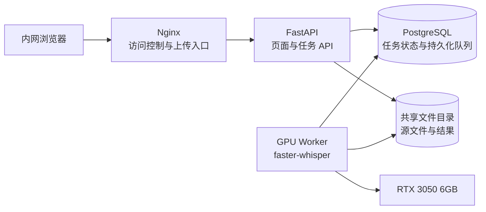
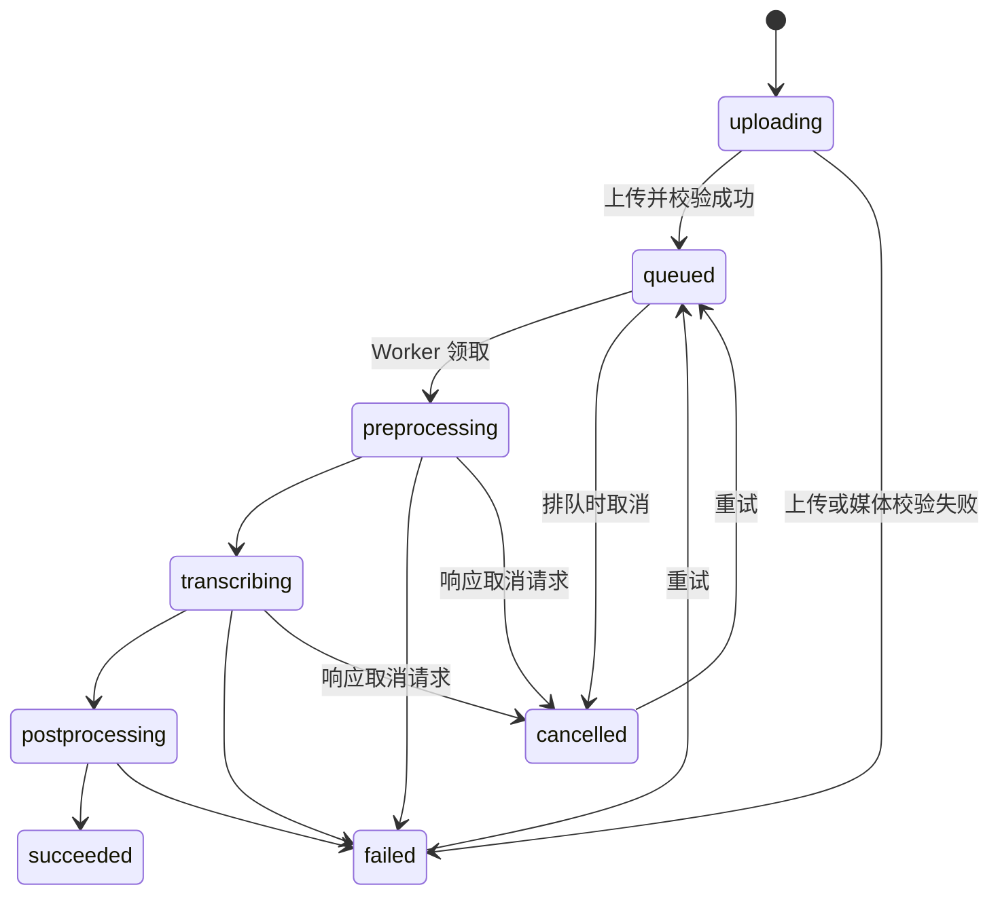

# Faster-Whisper 内网异步转写服务方案（历史版本）

> 本文件保留早期方案讨论，不再作为实现依据。当前唯一执行基线为
> [`IMPLEMENTATION_SPEC.md`](../IMPLEMENTATION_SPEC.md)。后续确认已经移除
> PostgreSQL、Nginx 和身份认证，并将部署目标调整为单容器、SQLite
> 持久任务队列以及可切换的 CPU/CUDA 运行方式。

## 1. 目标与范围

在 `dayu-server` 上部署一个仅供内网访问的 Web 服务：

- 上传音频或视频文件；
- 上传完成后创建异步语音转写任务；
- 页面查看任务列表、状态、进度、耗时和错误；
- 使用 NVIDIA GPU 运行 `faster-whisper`；
- 查看转写文本并下载 TXT、SRT、VTT、JSON；
- 支持取消、失败重试和任务删除；
- 服务、任务和结果在重启后可恢复。

第一版明确不包含：

- OpenClaw 集成；
- 说话人分离；
- 大模型摘要、纠错或翻译；
- 从外部 URL 下载媒体；
- 多 GPU 调度；
- 每个任务任意切换模型。

这样可以先把“上传—排队—GPU 转写—查看结果”的闭环做稳定，后续 OpenClaw 只需调用同一套 API。

## 2. 已知运行条件

方案以刚才在服务器上确认的条件为基础：

- Ubuntu 24.04；
- NVIDIA RTX 3050 6GB；
- NVIDIA 580 驱动当前可用；
- `nvidia-smi` 正常；
- CTranslate2 能识别 1 张 CUDA GPU；
- `faster-whisper 1.2.1` 已安装并能枚举 CUDA 计算类型；
- 服务器约 31GB 内存，磁盘空间充足。

RTX 3050 只有 6GB 显存，因此第一版必须限制为单 GPU Worker、单任务推理，避免多个任务同时加载模型导致显存不足。

## 3. 推荐架构



建议使用 Docker Compose 管理四个组件：

1. **Nginx**
   - 只监听服务器内网地址；
   - 提供 Basic Auth 或统一入口认证；
   - 限制上传体积、超时和访问来源；
   - 转发 API，并提供前端静态资源。

2. **FastAPI Web**
   - 接收流式上传，不把完整文件读入内存；
   - 创建任务、查询任务、取消、重试和下载结果；
   - 不直接执行模型推理。

3. **GPU Worker**
   - 启动时加载一次 `faster-whisper` 模型；
   - 从 PostgreSQL 原子领取一个排队任务；
   - 校验和预处理媒体；
   - 使用 GPU 转写并持续更新进度；
   - 原子发布结果文件后再将任务标记为成功。

4. **PostgreSQL**
   - 同时作为任务数据源和持久化任务队列；
   - Web 与 Worker 重启不会丢失任务；
   - 使用行锁防止同一任务被重复领取。

### 为什么第一版不使用 Redis/Celery

当前只有一张 GPU，实际只能稳定运行一个推理任务。PostgreSQL 已经需要保存任务状态，用数据库行锁即可完成单消费者队列，避免 Redis 与数据库出现两套状态。

Worker 可使用类似以下逻辑领取任务：

```sql
SELECT id
FROM transcription_tasks
WHERE status = 'queued'
ORDER BY queued_at
FOR UPDATE SKIP LOCKED
LIMIT 1;
```

未来增加多张 GPU 或复杂优先级、定时任务后，再评估 Redis/Celery。

### 为什么不直接以 Speaches 为核心

Speaches 更适合快速提供 OpenAI 兼容的转写接口；当前产品还需要持久化任务、上传生命周期、进度、取消、重试、任务列表和故障恢复。直接在 Worker 中调用 `faster-whisper`，状态控制更清楚，也不需要再包一层同步接口。

## 4. 技术选型

| 层 | 推荐选择 | 原因 |
|---|---|---|
| 前端 | Vue 3 + Vite | 适合任务列表、上传进度和详情交互 |
| API | FastAPI | Python 生态与媒体处理、Worker 共用数据模型 |
| ORM/迁移 | SQLAlchemy + Alembic | 明确管理任务表和后续升级 |
| 数据库 | PostgreSQL | 并发状态更新、行锁、故障恢复更可靠 |
| GPU 推理 | faster-whisper + CTranslate2 | 直接使用当前已验证的 CUDA 环境 |
| 媒体检查 | ffprobe | 获取真实媒体信息并确认存在音轨 |
| 媒体预处理 | ffmpeg | 将输入统一为稳定的单声道 16kHz 音频 |
| 入口 | Nginx | 内网访问控制、上传限制和反向代理 |
| 部署 | Docker Compose | 与 OpenClaw 等已有服务隔离，便于升级和回滚 |

## 5. GPU 与模型策略

### 第一版默认配置

- `device=cuda`
- `compute_type=int8_float16`
- 默认模型候选：`turbo`
- `vad_filter=true`
- GPU Worker 数量：1
- Worker 推理并发：1
- 默认禁止自动回退 CPU

`faster-whisper` 官方支持 GPU、量化、VAD、单词时间戳和批量推理；其官方基准也表明 int8 可明显降低显存占用。不过当前 RTX 3050 6GB 的真实速度和准确率仍应以服务器实测为准。[faster-whisper 官方仓库](https://github.com/SYSTRAN/faster-whisper)

### 模型选择方法

正式开发前，使用真实中文和中英混合材料对以下两组做基准：

| 配置 | 定位 |
|---|---|
| `turbo + int8_float16` | 默认候选，优先吞吐和较低显存 |
| `large-v3 + int8_float16` | 准确率候选，确认 6GB 显存和速度是否可接受 |

至少测试 1 分钟、10 分钟和 60 分钟媒体，记录：

- 转写总耗时；
- 实时系数 RTF：处理时间 ÷ 媒体时长；
- 峰值显存；
- 中文专有名词、数字和中英混合准确率；
- 长音频是否稳定；
- 静音和背景噪声下的误识别情况。

第一版固定一个服务级模型，不允许任务随意切换模型，避免重复加载和显存抖动。批量推理在基准验证前也不默认开启。

### GPU 故障处理

如果 CUDA、驱动或模型加载失败：

- Worker 停止领取新任务；
- 已排队任务继续保持 `queued`；
- 页面明确显示“GPU Worker 不可用”；
- 不静默切换 CPU，以免任务突然耗时数小时；
- 修复后 Worker 自动继续处理队列。

## 6. 任务状态机



状态字段和进度分开保存：

- `status`：任务最终/运行状态；
- `stage`：当前处理阶段；
- `progress`：0～100；
- `message`：给页面显示的短信息。

建议进度区间：

- 上传：由浏览器直接显示已上传字节；
- 预处理：0～10；
- 转写：10～95，按当前分段结束时间 ÷ 媒体总时长估算；
- 结果生成：95～100。

取消采用协作式取消：排队任务立即取消；运行中任务设置 `cancel_requested`，Worker 在分段产出和阶段切换时检查。它不会保证毫秒级终止，但不会破坏已发布结果。

## 7. 上传与处理流程

1. 浏览器调用创建任务接口，取得任务 ID。
2. 浏览器把文件上传到该任务；页面显示上传进度。
3. API 将上传内容分块写入唯一临时路径，同时计算 SHA-256。
4. 检查文件大小、扩展名、实际媒体类型和音轨。
5. 校验成功后原子移动到任务源文件目录，并将任务置为 `queued`。
6. Worker 原子领取任务，写入 `worker_id`、开始时间和租约心跳。
7. 使用 ffmpeg 提取统一格式的音频工作文件。
8. faster-whisper 在 GPU 上逐段转写，持续更新进度和心跳。
9. 先在临时目录生成 JSON、TXT、SRT、VTT。
10. 所有结果生成成功后原子移动到结果目录。
11. 最后将数据库任务状态改为 `succeeded`。
12. 清理工作目录；源文件和结果按保留策略定期清理。

“结果文件已完整发布”必须先于“数据库标记成功”，避免页面看到成功却下载不到结果。

## 8. API 草案

### 任务与上传

| 方法 | 路径 | 用途 |
|---|---|---|
| `POST` | `/api/tasks` | 创建上传任务，返回任务 ID |
| `PUT` | `/api/tasks/{id}/source` | 流式上传源文件，成功后进入队列 |
| `GET` | `/api/tasks` | 分页查询任务，支持状态和关键词筛选 |
| `GET` | `/api/tasks/{id}` | 查询任务、进度、错误和结果信息 |
| `POST` | `/api/tasks/{id}/cancel` | 取消排队或运行中的任务 |
| `POST` | `/api/tasks/{id}/retry` | 重试失败或已取消任务 |
| `DELETE` | `/api/tasks/{id}` | 软删除任务并等待后台清理 |

### 结果与系统状态

| 方法 | 路径 | 用途 |
|---|---|---|
| `GET` | `/api/tasks/{id}/artifacts/text` | 下载 TXT |
| `GET` | `/api/tasks/{id}/artifacts/srt` | 下载 SRT |
| `GET` | `/api/tasks/{id}/artifacts/vtt` | 下载 VTT |
| `GET` | `/api/tasks/{id}/artifacts/json` | 下载结构化 JSON |
| `GET` | `/api/system/status` | GPU、Worker、模型、队列和磁盘状态 |
| `GET` | `/healthz` | Web 进程存活检查 |
| `GET` | `/readyz` | 数据库、存储等依赖就绪检查 |

创建任务接口支持 `Idempotency-Key`，避免重复点击产生多个任务。相同文件哈希只提示重复，不自动合并，因为不同语言参数可能需要重新转写。

## 9. 数据设计

### `transcription_tasks`

核心字段：

- `id`：UUID；
- `idempotency_key`；
- `original_name`、`stored_name`、`media_type`；
- `size_bytes`、`sha256`、`duration_ms`；
- `language_requested`、`language_detected`；
- `model_name`、`compute_type`；
- `status`、`stage`、`progress`；
- `attempt`、`max_attempts`；
- `cancel_requested`；
- `worker_id`、`heartbeat_at`、`lease_expires_at`；
- `error_code`、`error_message`；
- `created_at`、`queued_at`、`started_at`、`finished_at`、`updated_at`；
- `deleted_at`。

主要索引：

- `(status, queued_at)`：Worker 领取任务；
- `(created_at DESC)`：任务列表；
- `(sha256)`：重复文件提示；
- `idempotency_key` 唯一索引。

### `task_artifacts`

保存每个任务的文件产物：

- `task_id`；
- `kind`：`source`、`txt`、`srt`、`vtt`、`json`；
- `path`、`size_bytes`、`sha256`；
- `created_at`。

路径只保存服务生成的内部相对路径，绝不直接使用用户文件名拼接路径。

## 10. 文件目录

建议宿主机使用独立数据根目录：

```text
/srv/faster-whisper/
├── data/
│   ├── incoming/       # 未完成上传
│   ├── sources/        # 已校验源文件
│   ├── work/           # 可回收中间文件
│   └── results/        # TXT/SRT/VTT/JSON
├── models/             # 固定的模型缓存
├── postgres/           # PostgreSQL 数据
└── logs/               # 服务日志或日志挂载
```

任务目录全部使用 UUID。结果重试时写入独立 attempt 工作目录，成功后再发布，避免旧结果和新结果混杂。

建议初始保留策略：

- 未完成上传：24 小时后清理；
- 工作目录：任务结束立即清理，异常残留 24 小时后清理；
- 成功任务源文件：默认保留 7 天；
- 结果文件：默认保留 90 天；
- 软删除：24 小时后物理删除。

以上时间应通过环境变量配置，并在页面显示到期时间。清理器每次仅处理明确的任务 UUID 目录，不执行宽泛路径删除。

## 11. Web 页面

### 首页/任务列表

- 拖拽或选择多个音视频文件；
- 上传前选择语言：自动、中文、英文；
- 每个文件单独生成一个任务；
- 顶部显示 GPU 状态、当前模型、正在处理数和排队数；
- 支持状态筛选、文件名搜索和分页；
- 列表字段：
  - 文件名；
  - 媒体时长和大小；
  - 状态/阶段；
  - 进度；
  - 创建时间；
  - 排队时间或处理耗时；
  - 操作。

### 任务详情

- 转写文本预览；
- 检测语言、媒体时长、模型和计算类型；
- 分段时间戳；
- 当前阶段和错误原因；
- 下载 TXT/SRT/VTT/JSON；
- 取消、失败重试、删除。

第一版使用轻量轮询即可：存在活动任务时每 2 秒查询增量状态，没有活动任务时降低到 10 秒。单机内网场景不必立即引入 WebSocket。

## 12. 安全边界

即使只在内网，也应满足：

- Nginx 只绑定内网地址，防火墙只放行指定网段；
- 第一版使用 Basic Auth；需要任务归属时再增加用户系统；
- 限制单文件大小和媒体时长，例如初始 2GB、8 小时；
- 上传必须流式写盘，不能将完整文件载入内存；
- 使用扩展名白名单，但最终以 ffprobe 结果为准；
- 没有音轨、媒体损坏或超限时明确失败；
- 不支持 URL 抓取，避免 SSRF；
- ffmpeg 使用参数数组调用，不经过 shell；
- Web 与 Worker 使用非 root 用户；
- 日志不记录完整转写内容；
- 下载接口必须通过认证且校验任务 ID；
- 对上传和创建任务接口限速；
- 数据目录不由 Nginx直接暴露，只通过授权下载接口读取。

## 13. 故障恢复

Worker 处理任务时定期更新心跳和租约。

- Worker 正常退出：停止领取新任务，当前任务按策略中断；
- Worker 异常退出：租约超时后恢复器将任务重新排队；
- 超过最大重试次数：任务标记 `failed`，保留错误信息；
- Web 重启：任务状态不受影响；
- PostgreSQL 重启：Worker 暂停，恢复连接后继续；
- GPU 不可用：Worker 不领任务，页面显示降级；
- 磁盘空间低于阈值：禁止新上传，已有结果仍可下载；
- 结果生成部分成功：不发布临时文件，不标记成功。

默认自动重试只针对进程退出、数据库短暂断开等基础设施错误。损坏文件、无音轨、格式不支持等输入错误不自动重试。

## 14. 日志与运行监控

结构化日志至少包含：

- `request_id`、`task_id`、`worker_id`；
- 阶段、状态、耗时；
- 媒体时长、模型、设备和计算类型；
- RTF、峰值显存；
- 错误代码和简化错误信息。

页面系统状态应展示：

- GPU 是否可用；
- 当前模型是否已加载；
- 当前处理任务；
- 排队任务数；
- 最近一次 Worker 心跳；
- 数据盘剩余空间。

后续需要告警时再接 Prometheus/Grafana；第一版先提供结构化日志与系统状态接口。

## 15. 部署与驱动治理

部署前需要完成：

1. 固定并验证当前可用的 NVIDIA 580 驱动系列；
2. 避免无人值守更新单独替换 NVIDIA 内核模块或用户态库；
3. 不建议关闭全部系统安全更新，应只对 NVIDIA 驱动升级做受控维护；
4. 安装并验证 Docker 与 NVIDIA Container Toolkit；
5. 在容器内执行 GPU 探针，确认 CTranslate2 能识别 CUDA；
6. 预下载并固定模型文件，生产启动时不依赖临时网络下载；
7. 固定 Python 依赖、容器镜像和模型 revision；
8. 只给 GPU Worker 配置 GPU，Web 和 PostgreSQL 不需要 GPU；
9. 配置容器健康检查、自动重启和日志轮转；
10. 备份 PostgreSQL 与结果目录。

模型、应用和数据库升级使用固定版本镜像；先在测试任务上验证，再替换运行版本。回滚时恢复上一版本镜像，数据库迁移必须提供向后兼容或明确回滚脚本。

## 16. 开发顺序

### 阶段 A：GPU 基准与产品契约

- 用真实样本比较 `turbo` 和 `large-v3`；
- 确定默认模型、计算类型和质量预期；
- 固定最大文件、最大时长、保留期；
- 确认是否需要单词级时间戳。

### 阶段 B：任务后端与 Worker

- 数据库迁移；
- 上传、媒体校验和文件原子发布；
- 数据库队列、租约和故障恢复；
- faster-whisper GPU 转写；
- TXT/SRT/VTT/JSON 生成；
- 取消、重试和清理。

### 阶段 C：Web 页面

- 上传界面与上传进度；
- 任务列表、筛选和轮询；
- 任务详情、文本预览和结果下载；
- GPU/队列/磁盘状态。

### 阶段 D：部署与验收

- Compose、Nginx、认证和内网防火墙；
- GPU 容器验证；
- 重启恢复、错误输入和磁盘保护测试；
- 日志、备份和回滚演练。

## 17. 验收清单

功能验收：

- MP3、WAV、M4A、MP4、MOV 可上传并转写；
- 上传后立即得到任务，页面可看到排队和处理进度；
- 成功任务可预览文本并下载四种格式；
- 排队任务可立即取消，运行任务可协作式取消；
- 失败任务可以重试；
- 损坏文件、无音轨和超限文件返回可理解的错误；
- 重复点击不会重复创建任务。

运行时验收：

- `nvidia-smi` 能看到 Worker 的 GPU 进程和显存占用；
- 同一时刻最多一个 GPU 转写任务；
- Web 重启不影响 Worker 当前任务；
- Worker 异常重启后任务能恢复，不永久卡在处理中；
- GPU 故障时不自动退回 CPU；
- 60 分钟真实音视频连续处理无显存溢出；
- 临时文件在成功、失败、取消后均按规则清理；
- 磁盘低水位时停止新上传；
- 服务只能从指定内网网段访问。

质量验收：

- 使用固定中文、中英混合、噪声、静音和专有名词样本形成回归集；
- 每次更换驱动、模型或依赖后重新运行回归集；
- 记录基准 RTF、峰值显存和人工抽查结果；
- 在完成真实基准后再确定处理时长 SLA，不凭理论数据承诺。

## 18. 最终建议

第一版采用：

> **Vue 3 + FastAPI + PostgreSQL 持久化队列 + 单 GPU Worker + faster-whisper + Nginx + Docker Compose**

关键约束：

- 默认 `turbo + int8_float16`，最终由真实中文样本基准确认；
- 一张 RTX 3050 只运行一个推理任务；
- PostgreSQL 是任务状态和队列的唯一真相源；
- 不引入 Redis/Celery、WebSocket、说话人分离和 OpenClaw；
- GPU 不可用时明确停队列，不静默使用 CPU；
- 先完成可恢复的任务闭环，再扩展外部调用和高级能力。
